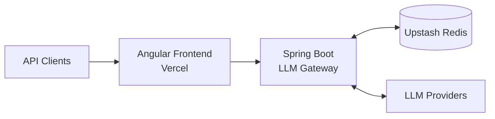
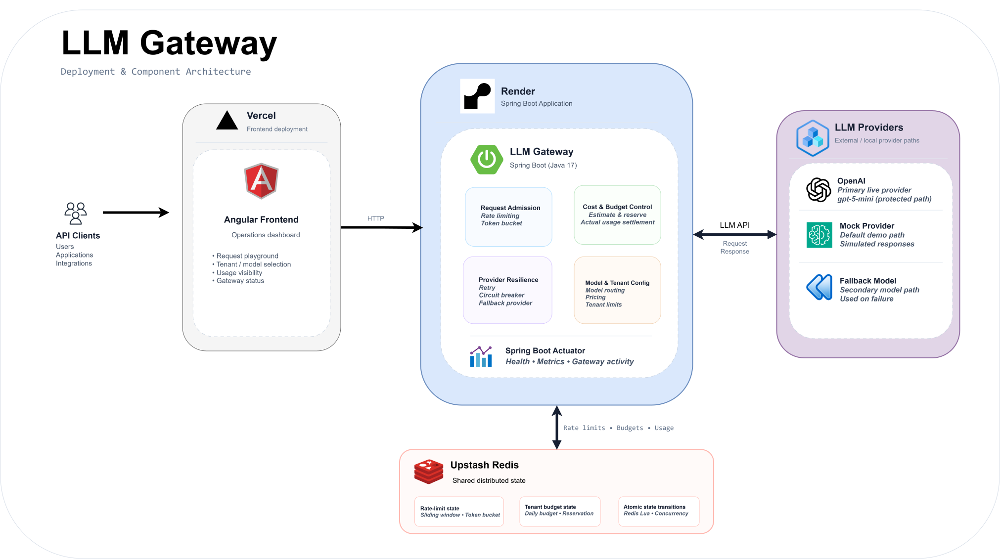
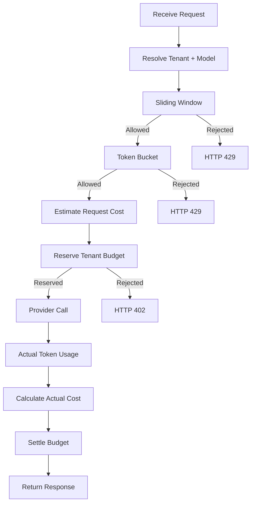
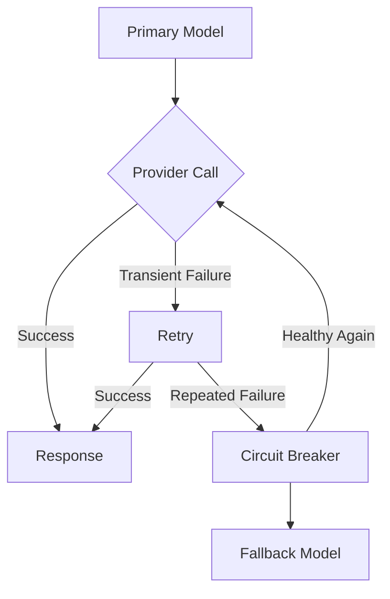

# LLM Gateway — High-Level Design

> A distributed gateway for controlling LLM traffic through request-rate limiting, token-capacity limiting, tenant cost budgets, provider resilience, and usage-based settlement.

---

## 1. System Overview

LLM Gateway sits between clients and LLM providers and acts as an enforcement and orchestration layer for multi-tenant LLM traffic.

Unlike traditional APIs, LLM requests can consume dramatically different amounts of compute and money.

For example:

```text
Request A → 50 tokens
Request B → 5,000 tokens
```

A request-count-only rate limiter treats both requests equally even though their resource consumption can be very different.

The gateway therefore controls three independent dimensions:

```text
Request frequency
       +
Token capacity
       +
Tenant monetary budget
```

Provider resilience and actual usage settlement are then applied around the provider interaction.

### High-Level Flow



### Runtime Boundaries

| Boundary | Responsibility |
|---|---|
| Angular / Vercel | Operational dashboard and request playground |
| Spring Boot / Render | Request admission, orchestration, provider protection and settlement |
| Upstash Redis | Shared distributed rate-limit, token and budget state |
| LLM Providers | Model inference and actual token usage |

The production deployment separates the Angular frontend from the Spring Boot backend. Redis provides shared state so rate-limit and budget decisions are not isolated to a single gateway instance.

---

# 2. Design Goals

The system is designed around the following goals.

### 2.1 Control Request Frequency

Prevent a tenant from generating an excessive number of requests within a configured time window.

### 2.2 Control Token Consumption

Request count alone is insufficient for LLM traffic. The gateway therefore maintains token-capacity state using a token bucket.

### 2.3 Enforce Tenant Spending Limits

Each tenant has a daily cost budget. Requests are admitted only when their estimated cost can be reserved without exceeding the available budget.

### 2.4 Preserve Correctness Under Concurrency

Multiple gateway instances may process requests for the same tenant concurrently.

Rate-limit and budget state transitions therefore require atomic read-modify-write behavior.

### 2.5 Protect Providers From Failures

Transient provider failures should be retried, while sustained failures should cause the circuit breaker to stop repeatedly sending traffic to an unhealthy provider.

### 2.6 Account for Actual Usage

The initial cost is only an estimate.

After the provider responds, the gateway uses actual token usage when available and settles the previously reserved budget accordingly.

### 2.7 Provide Operational Visibility

The system exposes health and metrics through Spring Boot Actuator and exposes request-level usage information through the dashboard.

---

# 3. Non-Goals

The current system intentionally does not attempt to provide:

- A general-purpose API gateway for arbitrary backend services
- A persistent tenant-management platform
- A distributed configuration-management service
- Full production-grade authentication and authorization
- Distributed tracing infrastructure
- A dedicated load-testing platform
- Dynamic provider routing based on real-time provider quality or price
- Redis Cluster-specific optimization

These are possible future extensions rather than responsibilities of the current implementation.

---

# 4. Component Architecture

The system consists of four major architectural areas.



## 4.1 Frontend

The Angular application provides the operational dashboard.

It exposes:

- Request playground
- Tenant and model selection
- Gateway status
- Request-level usage information
- Estimated and actual cost visibility
- Provider and circuit state visibility

The frontend is deployed independently from the backend.

---

## 4.2 Gateway

The Spring Boot application is the central enforcement and orchestration layer.

Its major responsibilities are:

```text
Request Admission
       │
       ├── Sliding Window
       └── Token Bucket

Cost & Budget Control
       │
       ├── Cost estimation
       ├── Budget reservation
       └── Actual-cost settlement

Provider Resilience
       │
       ├── Retry
       ├── Circuit Breaker
       └── Fallback Model

Model / Tenant Configuration
       │
       ├── Model routing
       ├── Pricing
       └── Tenant limits

Observability
       │
       └── Spring Boot Actuator
```

---

## 4.3 Distributed State

Upstash Redis provides shared state for the gateway.

Conceptually:

```text
Redis
├── Sliding-window request state
├── Token-bucket state
├── Tenant budget state
└── Usage / reservation state
```

Redis is deliberately outside the gateway process because the gateway may run across multiple instances.

Local in-memory state would allow different gateway instances to make decisions using different counters.

---

## 4.4 LLM Providers

The gateway supports multiple provider paths:

```text
Primary live path
    └── OpenAI / gpt-5-mini

Default demo path
    └── Mock provider

Failure path
    └── Fallback model
```

The provider call is protected by the resilience layer.

---

# 5. Request Lifecycle

Every request passes through the gateway before reaching an LLM provider.



The ordering is intentional.

The gateway does not call the provider first and charge the tenant afterward.

Instead:

```text
Estimate
   ↓
Reserve
   ↓
Execute
   ↓
Measure actual usage
   ↓
Settle
```

This prevents multiple concurrent requests from independently observing the same remaining budget and then spending it simultaneously.

---

# 6. Request Admission

Request admission uses two independent controls:

```text
                    Request
                       │
                       ▼
              ┌─────────────────┐
              │ Sliding Window  │
              └────────┬────────┘
                       │
                       ▼
              ┌─────────────────┐
              │  Token Bucket   │
              └────────┬────────┘
                       │
                       ▼
                 Cost Control
```

The mechanisms solve different problems.

| Mechanism | Question Answered |
|---|---|
| Sliding Window | How frequently is this tenant making requests? |
| Token Bucket | Does this tenant have sufficient token capacity? |
| Tenant Budget | Can this request be financially admitted? |

---

# 7. Sliding-Window Rate Limiting

The gateway uses a Redis sorted set to maintain request timestamps for each tenant/model.

Current configuration:

```yaml
window-seconds: 60
max-requests: 100
```

The logical operation is:

```text
Remove expired entries
        ↓
Count active requests
        ↓
Check configured limit
        ↓
Add current request
        ↓
Return admission decision
```

The complete state transition is executed atomically using Redis Lua.

## 7.1 Why a Sliding Window?

A simple fixed counter can create boundary effects where requests near the end of one window and the beginning of the next window are both admitted.

The sliding-window model evaluates the actual recent request history.

## 7.2 Distributed Behavior

The state lives in Redis rather than inside the JVM.

Therefore:

```text
Gateway Instance A ─┐
Gateway Instance B ─┼──► Redis
Gateway Instance C ─┘
```

all instances make decisions against the same rate-limit state.

---

# 8. Token Bucket

The second admission layer controls token capacity rather than request frequency.

Each tenant/model bucket conceptually contains:

```text
available_tokens
last_refill
```

The current configuration is:

```yaml
capacity: 10000
refill-rate-per-sec: 50
```

The logical model is:

```text
                     Time
                      │
                      ▼
              Refill available tokens
                      │
                      ▼
              Estimate request tokens
                      │
                      ▼
             Enough capacity?
                /          \
              yes           no
               │             │
               ▼             ▼
          Consume tokens    Reject
```

The bucket state transition is performed inside Redis Lua.

This prevents the following race:

```text
Instance A              Instance B

read 100 tokens         read 100 tokens
request costs 80        request costs 80
approve                  approve
write 20                 write 20
```

Both requests could incorrectly succeed if the read and update were performed independently.

With the Lua-based transition, the decision and state update occur atomically.

---

# 9. Why Both Rate-Limiting Mechanisms?

The gateway intentionally controls two different resources.

### Sliding Window

Controls:

> Request frequency

Example:

```text
100 requests / 60 seconds
```

### Token Bucket

Controls:

> Token consumption / burst capacity

Example:

```text
10,000 token capacity
50 tokens/sec refill
```

These mechanisms are complementary.

A tenant could remain below a request-count limit while sending very large prompts.

Conversely, a tenant could make many small requests without consuming the same amount of token capacity.

Using both gives the gateway independent protection against these different traffic patterns.

---

# 10. Cost & Budget Control

LLM cost is model-dependent and depends on actual token usage.

The gateway therefore separates:

```text
Estimated Cost
      │
      ▼
Budget Reservation
      │
      ▼
Provider Execution
      │
      ▼
Actual Usage
      │
      ▼
Actual Cost
      │
      ▼
Settlement
```

## 10.1 Cost Estimation

Before the provider call, the gateway estimates the maximum expected cost for the request.

The estimate is based on the selected model's pricing and expected token usage.

The estimate is used for admission rather than treating the request as free until the provider responds.

---

## 10.2 Budget Reservation

The estimated amount is atomically reserved against the tenant's daily budget.

Conceptually:

```text
current spend
      +
estimated request cost
      <=
daily budget
```

If the reservation would exceed the available budget, the request is rejected before the provider call.

The current API behavior exposes this condition as:

```text
HTTP 402
```

---

## 10.3 Actual Usage Settlement

The initial reservation is not assumed to be the final cost.

After the provider responds, the gateway obtains actual usage when available.

For example:

```text
Reserved:
$0.000010

Actual:
$0.000002
```

The difference is released back to the tenant's available budget.

Conceptually:

```text
reserved cost
      -
actual cost
      =
budget adjustment
```

This is important because estimated usage and actual provider usage can differ.

---

# 11. Provider Resilience

Provider calls are protected using Resilience4j.

The high-level behavior is:



The responsibilities are different.

### Retry

Handles transient provider failures.

### Circuit Breaker

Prevents repeatedly sending traffic to a provider that is experiencing sustained failures.

### Fallback

Provides an alternate model path when the protected primary path ultimately cannot serve the request.

---

## 11.1 Circuit Breaker Configuration

The current configuration uses:

```text
Sliding window:        20 calls
Failure threshold:     40%
Open-state wait:       10 seconds
Half-open calls:       5
```

The state transition is:

```text
CLOSED
   │
   │ failure threshold exceeded
   ▼
OPEN
   │
   │ wait duration
   ▼
HALF_OPEN
   │
   ├── successful calls ──► CLOSED
   │
   └── failures ──────────► OPEN
```

This behavior has been tested through the configured circuit-breaker state transitions.

---

# 12. Distributed State & Redis

Redis is the shared coordination layer for gateway instances.

The main state categories are:

```text
                    Upstash Redis
                         │
          ┌──────────────┼──────────────┐
          │              │              │
          ▼              ▼              ▼
    Sliding Window   Token Bucket   Tenant Budget
       State            State          State
```

The application does not rely on local JVM memory for these distributed controls.

---

# 13. Redis Lua Atomicity

Several gateway operations contain read-modify-write sequences.

For example, budget reservation conceptually requires:

```text
Read current spend
        +
Calculate new spend
        +
Validate budget
        +
Update spend
        ↓
Atomic state transition
```

If these operations were executed as independent Redis commands, another gateway instance could modify the same state between the operations.

Lua moves the complete decision and state transition into Redis.

The same principle is used for:

- Sliding-window admission
- Token-bucket state transitions
- Tenant budget reservation and settlement

This provides atomicity at the Redis state-transition boundary.

---

# 14. Multi-Tenant Isolation

Rate-limit and budget state are scoped using tenant and model identifiers.

Conceptually:

```text
tenant-A : primary-model
tenant-A : gpt-5-mini

tenant-B : primary-model
tenant-B : gpt-5-mini
```

This means tenant A's request activity does not consume tenant B's rate-limit or budget state.

The model dimension also allows model-specific pricing and capacity behavior to be tracked independently.

The frontend generates a session-scoped demo tenant so separate browser sessions can exercise the gateway independently.

---

# 15. Model & Pricing Configuration

The gateway associates pricing with the selected model.

Usage tracking distinguishes:

```text
Input tokens
Output tokens
Total tokens
Estimated cost
Actual cost
```

For the live provider, provider-reported usage is used when available.

This allows the gateway to distinguish between:

```text
Admission estimate
        ≠
Final provider cost
```

That distinction is fundamental to the reservation/settlement model.

---

# 16. Observability

Spring Boot Actuator provides runtime health and metrics.

The system exposes visibility into:

- HTTP request metrics
- Gateway request activity
- Provider/circuit-breaker state
- Application health
- Prometheus-compatible metrics

The Angular dashboard additionally exposes request-level information such as:

```text
Model
Total tokens
Input tokens
Output tokens
Latency
Estimated cost
Actual cost
Budget reserved
Actual usage
Budget adjustment
```

The observability layer is intentionally separate from the admission-control logic.

---

# 17. Failure Handling

The gateway maps different failure categories to different outcomes.

| Condition | Response |
|---|---:|
| Invalid request | `400` |
| Request-rate limit exceeded | `429` |
| Token capacity exhausted | `429` |
| Daily budget exceeded | `402` |
| Provider operation unavailable | `502` |
| Protected live-model access denied | `403` |

The distinction allows clients to determine whether they should:

- Correct the request
- Wait and retry
- Reduce consumption
- Address budget constraints
- Handle provider unavailability

For rate-limit responses, retry information can also be returned to the client.

---

# 18. Concurrency Model

Concurrency is one of the primary reasons Redis is used instead of local memory.

Consider:

```text
Tenant budget = $1.00

Request A → $0.70
Request B → $0.70
```

A naïve implementation could allow both requests to observe:

```text
available = $1.00
```

before either request updates the state.

The result could be:

```text
$0.70 + $0.70 = $1.40
```

against a `$1.00` budget.

The gateway instead performs the reservation as an atomic Redis state transition.

Therefore the decision is effectively serialized at the Redis state-transition level:

```text
Request A ──┐
            ├──► Atomic Redis operation
Request B ──┘
```

Only requests that can successfully reserve the available budget are allowed to proceed.

The same atomicity principle applies to rate-limit state.

---

# 19. Scalability Considerations

The gateway is designed so that application instances can scale horizontally without creating independent rate-limit state.

Conceptually:

```text
                 Load Balancer
                      │
          ┌───────────┼───────────┐
          │           │           │
          ▼           ▼           ▼
       Gateway     Gateway     Gateway
       Instance    Instance    Instance
          │           │           │
          └───────────┼───────────┘
                      │
                      ▼
               Upstash Redis
                      │
          ┌───────────┼───────────┐
          ▼           ▼           ▼
       Rate State  Token State  Budget State
```

This provides shared coordination across gateway instances.

### Important Scaling Dependency

Redis itself becomes an important scaling dependency.

At significantly larger scale, the system would need to consider:

- Redis Cluster
- Key distribution
- Hot tenants
- Memory growth
- TTL strategy
- Connection-pool sizing
- Regional placement
- Redis availability and failure behavior

These concerns are outside the current demo deployment but are relevant to production evolution.

---

# 20. Data Growth Considerations

The sliding-window implementation stores request timestamps.

The amount of state therefore depends approximately on:

```text
number of tenants
×
request frequency
×
window duration
```

At higher scale, the architecture would need to evaluate:

- Redis memory consumption
- Key expiration
- Hot-key concentration
- Tenant traffic distribution
- Redis Cluster partitioning

Similarly, token-bucket and budget state require lifecycle management as the number of tenants grows.

---

# 21. Performance

A local sequential benchmark was performed against the Spring Boot gateway using Redis and the mock provider.

| Metric | Result |
|---|---:|
| Requests attempted | 100 |
| Valid successful samples | 99 |
| Average latency | 7.05 ms |
| p50 | 5.74 ms |
| p95 | 15.09 ms |
| p99 | 22.77 ms |
| Maximum | 23.94 ms |
| Sequential throughput | ~141.85 req/s |

These numbers are an implementation baseline only.

They are **not** a production capacity claim and are not a substitute for a dedicated concurrent load/stress test.

The benchmark was sequential and local, so it does not represent the behavior of the deployed system under distributed concurrency.

---

# 22. Key Design Trade-offs

## 22.1 Redis vs In-Memory State

### Redis

Advantages:

- Shared across gateway instances
- Atomic operations through Lua
- Centralized distributed state

Trade-off:

- Adds network dependency
- Adds an operational dependency on Redis

### In-Memory State

Advantages:

- Lower local latency
- Simpler implementation

Trade-off:

- State diverges between gateway instances
- Horizontal scaling becomes difficult
- Correct distributed enforcement becomes unreliable

For this gateway, shared Redis state is preferred because correctness across instances is more important than eliminating one network hop.

---

## 22.2 Sliding Window vs Fixed Window

A fixed window is simpler.

However, a sliding window provides a more accurate representation of recent request frequency and avoids simple fixed-window boundary effects.

The implementation therefore uses a Redis sorted-set-based sliding window.

---

## 22.3 Token Bucket vs Request Rate Only

Request rate measures:

> How many requests?

Token capacity measures:

> How much token consumption?

LLM workloads require both dimensions because request size can vary substantially.

---

## 22.4 Reservation vs Charge-After-Response

Charging only after the provider responds is simpler but unsafe under concurrent requests.

Multiple requests could all pass a budget check before any of them are charged.

Reservation changes the sequence to:

```text
Reserve
   ↓
Execute
   ↓
Settle
```

This provides stronger protection against concurrent overspending.

---

## 22.5 Estimated vs Actual Cost

Using only estimated cost is simpler but can overcharge or under-account for actual usage.

Using provider-reported usage after execution allows the gateway to settle the difference.

The system therefore separates:

```text
Admission cost
      from
Final accounting cost
```

---

# 23. Future Evolution

The following capabilities are intentionally outside the current implementation:

- Distributed idempotency keys for safe client retries
- Redis Cluster-aware key design
- Configurable tenant policies
- Persistent tenant configuration
- Richer production telemetry
- Dedicated concurrent load/stress testing
- Production authentication and authorization
- Provider-specific adaptive routing
- More sophisticated token estimation

These should be treated as future architectural extensions rather than current system capabilities.

---

# 24. Summary

The core architectural problem can be summarized as:

```text
                LLM Traffic
                    │
                    ▼
             ┌─────────────┐
             │ Rate Control│
             └──────┬──────┘
                    │
                    ▼
             ┌─────────────┐
             │Token Control│
             └──────┬──────┘
                    │
                    ▼
             ┌─────────────┐
             │Budget       │
             │Reservation  │
             └──────┬──────┘
                    │
                    ▼
             ┌─────────────┐
             │  Provider   │
             │  Resilience │
             └──────┬──────┘
                    │
                    ▼
             ┌─────────────┐
             │Actual Usage │
             └──────┬──────┘
                    │
                    ▼
             ┌─────────────┐
             │  Settlement │
             └─────────────┘
```

The central design principle is:

> **Control the traffic, reserve the cost before execution, protect the provider, and settle against actual usage afterward.**

The distributed-systems foundation is Redis-backed atomic state transitions, allowing multiple gateway instances to make consistent rate-limit and budget decisions.